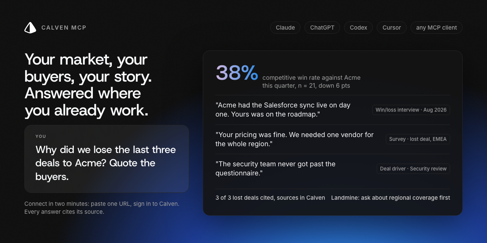

<p align="center">
  <a href="https://calven.ai/mcp">
    <picture>
      <source media="(prefers-color-scheme: dark)" srcset="docs/assets/symbol-white.svg">
      
    </picture>
  </a>
</p>

<h1 align="center">Calven MCP</h1>

<p align="center">Your positioning, personas, competitors and customer evidence, answered inside the AI tool you already use.</p>

<p align="center">
  Calven is an AI product marketing platform for B2B software teams. This connects it to Claude, ChatGPT, Codex, Cursor and any MCP client.<br>
  <a href="#connect-in-two-minutes">Connect</a> · <a href="#try-these-first">Prompts</a> · <a href="use-cases/">Use cases by team</a> · <a href="https://calven.ai/mcp">calven.ai/mcp</a> · <a href="https://app.calven.ai/sign-up">14-day trial, no card</a>
</p>

<p align="center">
  <a href="https://registry.modelcontextprotocol.io/?search=calven"></a>
  <a href="LICENSE"></a>
</p>

<p align="center">
  
</p>

You need a Calven workspace with your strategy, competitors and customer evidence in it ([14-day trial, no card](https://app.calven.ai/sign-up)). MCP is the open standard AI assistants use to read outside systems; connecting takes one URL and a sign-in.

Every answer runs with your own Calven login and your own permissions. The assistant reads your workspace. It does not search the web, it does not invent what is missing, and it writes nothing back.

## Works with

| Client | How you connect | Recorded |
|---|---|---|
|  Claude (claude.ai and desktop) | Settings → Connectors → Add custom connector → paste the URL → sign in | Pending test |
|  ChatGPT | Settings → Apps & Connectors → Advanced → Add MCP server → paste the URL → sign in (Plus, Pro, Business or Enterprise) | Pending test |
|  Claude Code | `claude mcp add --transport http calven https://api.calven.ai/mcp` | Verified path |
|  Codex | `codex mcp add calven --url https://api.calven.ai/mcp` | Verified path |
|  Cursor | Settings → MCP → Add server → paste the URL | In testing |
|  VS Code and GitHub Copilot | MCP: Add server → HTTP → paste the URL | In testing |

Any other client that speaks remote MCP with OAuth works the same way. "In testing" means the client supports remote MCP with OAuth and we are recording the clean-account test; the steps above are the ones to follow. See [client support](docs/client-support.md).

## Connect in two minutes

When your client asks for an MCP server URL, paste:

```text
https://api.calven.ai/mcp
```

Choose **OAuth** and sign in to Calven. That is the whole setup. Your assistant gets the same workspace access you have, nothing more.

<details>
<summary><b>Claude</b> (claude.ai, desktop)</summary>

1. Open **Settings → Connectors**.
2. Choose **Add custom connector**, name it `Calven`, paste the URL.
3. Click **Connect** and sign in to Calven in the browser window.
4. Start a new chat and enable Calven under the tools menu.

</details>

<details>
<summary><b>ChatGPT</b></summary>

1. Open **Settings → Apps & Connectors → Advanced settings** and turn on Developer mode.
2. Choose **Create** (or **Add MCP server**), name it `Calven`, paste the URL, pick **OAuth**.
3. Sign in to Calven when the browser window opens.
4. In a new chat, add Calven from the **+** menu.

Custom connectors need a Plus, Pro, Business or Enterprise plan.

</details>

<details>
<summary><b>Cursor</b></summary>

1. Open **Settings → MCP → Add new MCP server**.
2. Name `calven`, type **HTTP**, URL as above. Or add this to `~/.cursor/mcp.json`:

```json
{ "mcpServers": { "calven": { "url": "https://api.calven.ai/mcp" } } }
```

3. Cursor opens the Calven sign-in on first use.

</details>

<details>
<summary><b>VS Code and GitHub Copilot</b></summary>

Run **MCP: Add Server** from the command palette, choose **HTTP**, paste the URL, name it `calven`. VS Code opens the Calven sign-in on first use.

</details>

<details>
<summary><b>Claude Code and Codex</b> (command line)</summary>

```sh
claude mcp add --transport http calven https://api.calven.ai/mcp
codex mcp add calven --url https://api.calven.ai/mcp
```

Each opens the Calven sign-in on first use.

</details>

<details>
<summary><b>A client without OAuth</b></summary>

Create a personal key in [Calven → Settings → API & MCP](https://app.calven.ai/settings/api) and send it as `Authorization: Bearer <key>`. The [authentication guide](docs/authentication.md) has the per-client header setup. Keep the key out of shared config.

</details>

## Try these first

Paste any of these. The assistant picks the right Calven tools itself.

**Before a competitive call**

```text
Why did we lose the last three deals to Acme? Quote the buyers, then give me the landmine to set on a first call.
```

**The launch one-liner**

```text
Write the one-liner for the new audit trail feature for a Head of Security, using our messaging pillars and the words customers use for it on calls.
```

**The quarterly win/loss read**

```text
What is our competitive win rate this quarter, how did it move, and which product gap cost the most deals? Cite n.
```

**Proof for a page**

```text
Give me the top three pains customers named this quarter, each with a verbatim quote and its source, for the onboarding page.
```

**A fact check before it ships**

```text
Check every product, pricing and competitor claim in this draft against the product brief and the dossiers. Flag anything we cannot say. [paste draft]
```

**Copy through the buyer's eyes**

```text
Review this landing page against our buyer personas. Rank the findings by severity before rewriting anything. [paste draft]
```

Need the reusable version? Every prompt above comes from a longer workflow recipe your team can save as a snippet. Browse them by team in [use-cases/](use-cases/).

## Who uses it

Product marketing · Sales · Sales enablement · Demand generation · Content · Brand and communications · Customer marketing · Customer success · Support · Solutions engineering · Sales leadership · Revenue operations · Business development · Partnerships · Product management · Leadership · Finance · People · Legal

190 use cases, each with the work broken into steps, the prompts for the steps Calven helps with, and what it does not cover yet. Start at [use-cases/README.md](use-cases/README.md).

## What it can see, and what it never does

Your assistant can read, with sources:

- **Strategy documents:** positioning, messaging, product brief, ICP, per product where you have several.
- **Competitors:** dossiers, battlecards, this week's signals.
- **Buyers:** personas with pains, objections and messaging hooks; a persona review of any text you paste.
- **Customer voice:** conversations, themes, quotes, win/loss surveys and the drivers behind won and lost deals.
- **Market:** trends, opportunities, analyst findings.
- **Your product:** changes, drift findings, published claims.
- **Insights dashboards:** win rate, ICP fit, competitor momentum, messaging drift, every KPI with its change and its sample size.
- **CRM mirror:** accounts, contacts and deals, where your workspace allows it.

It never:

- writes, edits, sends or publishes anything (the one action is a persona review that returns findings);
- searches the web or fills a gap from model memory: an empty result means nothing is recorded, and it says so;
- sees anything your Calven role cannot. Workspace admins decide whether transcripts and pipeline are readable over MCP at all.

> [!IMPORTANT]
> Everything returned is your company's confidential data. Use an AI client and model provider your organization has approved. Removing a user from the workspace removes their MCP access with it. Details in [data handling](docs/data-handling.md).

Customer data is stored in the EU, a DPA with EU SCCs applies to every plan, and the SOC 2 Type I audit is in progress. Security controls and subprocessors are on the [Trust Center](https://trust.calven.ai).

## The plugin

Direct MCP gives your assistant the data. The Calven plugin ([Agent Plugins 1.0](https://agent-plugins.org/)) adds three repeatable workflows on top: a **workspace brief**, a **competitive brief** and a **persona copy review**. Same server, same permissions, better defaults. See [plugin setup](docs/plugin.md).

<details>
<summary><b>Tools, for the curious</b></summary>

Thirteen read tools and one action, documented in the [tool catalog](docs/tool-catalog.md). The server also ships four ready-made prompts: how do we compete with a competitor, a competitor's strengths, who our competitors are, and a monthly insights review. Your client lists them under prompts or slash commands.

</details>

## Help

- [calven.ai/mcp](https://calven.ai/mcp): the product page and FAQ
- [Troubleshooting](docs/troubleshooting.md) · [Authentication](docs/authentication.md) · [Client support](docs/client-support.md)
- [Open a connection issue](https://github.com/calven-ai/calven-mcp/issues/new/choose) · support@calven.ai

<details>
<summary><b>For developers and admins</b></summary>

This repository is the public distribution surface for Calven's hosted MCP server; the server source is private. Manifests (`server.json`, `plugin.json`, `mcp.json`), the validation script, versioning, conformance and the contribution guide live in [docs/](docs/) and [CONTRIBUTING.md](CONTRIBUTING.md). Security reports go through [SECURITY.md](SECURITY.md).

</details>

<p align="center"><sub>This repository (docs, manifests, skills, use cases) is MIT licensed; the Calven service is not · <a href="https://calven.ai/privacy">Privacy</a> · <a href="https://calven.ai/terms">Terms</a> · <a href="https://calven.ai/pricing">14-day free trial, no card</a></sub></p>
