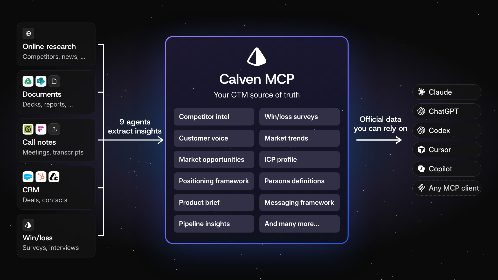

<p align="center">
  <a href="https://calven.ai/mcp">
    <picture>
      <source media="(prefers-color-scheme: dark)" srcset="docs/assets/symbol-white.svg">
      
    </picture>
  </a>
</p>

<h1 align="center">Calven MCP</h1>

<p align="center">Your approved ICP, positioning, messaging and competitive intel, with sources, in the AI tool your team already uses.</p>

<p align="center">
  <a href="#connect">Connect</a> · <a href="#try-it">Prompts</a> · <a href="use-cases/">Use cases by team</a> · <a href="https://calven.ai/mcp">calven.ai/mcp</a> · <a href="https://app.calven.ai/sign-up">14-day trial, no card</a>
</p>

<p align="center">
  <a href="https://registry.modelcontextprotocol.io/?search=calven"></a>
  <a href="LICENSE"></a>
</p>

<p align="center">
  
</p>

Calven's nine product marketing agents keep one source of truth on your market, buyers and positioning. Calven MCP puts it inside Claude, ChatGPT, Codex, Cursor, Copilot and any other MCP client, so sales, marketing, product and leadership work from the same answers your team approved.

## Connect

Paste this URL where your client asks for an MCP server, choose **OAuth**, and sign in to Calven:

```text
https://api.calven.ai/mcp
```

You need a Calven workspace ([14-day trial, no card](https://app.calven.ai/sign-up)). Test status for each client is in [client support](docs/client-support.md).

<details>
<summary><b>Claude</b> (claude.ai, desktop)</summary>

**Settings → Connectors → Add custom connector**, name it `Calven`, paste the URL, **Connect**. Enable Calven from the tools menu in a new chat.

</details>

<details>
<summary><b>ChatGPT</b></summary>

**Settings → Apps & Connectors → Advanced settings**, turn on Developer mode, then **Create**: name `Calven`, the URL, **OAuth**. Add Calven from the **+** menu in a new chat. Needs Plus, Pro, Business or Enterprise.

</details>

<details>
<summary><b>Cursor</b></summary>

**Settings → MCP → Add new MCP server**, name `calven`, type **HTTP**, the URL. Or in `~/.cursor/mcp.json`:

```json
{ "mcpServers": { "calven": { "url": "https://api.calven.ai/mcp" } } }
```

</details>

<details>
<summary><b>VS Code and GitHub Copilot</b></summary>

Command palette → **MCP: Add Server** → **HTTP**, paste the URL, name it `calven`.

</details>

<details>
<summary><b>Claude Code and Codex</b></summary>

```sh
claude mcp add --transport http calven https://api.calven.ai/mcp
codex mcp add calven --url https://api.calven.ai/mcp
```

</details>

<details>
<summary><b>A client without OAuth</b></summary>

Create a personal key in [Calven → Settings → API & MCP](https://app.calven.ai/settings/api) and send it as `Authorization: Bearer <key>`. See [authentication](docs/authentication.md). Keep the key out of shared config.

</details>

## Try it

**Sales:** walk into every deal knowing how you win it.

```text
Why did we lose our last three deals to Acme? Quote the buyers, then give me the first question to ask on my next call against them.
```

**Marketing:** campaigns in the buyer's words.

```text
Draft three ad headlines for Heads of Data in our customers' own words, then tell me which one our personas would pick.
```

**BDRs:** outreach tested on the buyer before it's sent.

```text
Would our buyer persona reply to this email? If not, rewrite it in our customers' words. [paste email]
```

**Product:** build what wins deals.

```text
Which product gaps cost us deals this year? Rank them by deals lost and quote the buyers.
```

**Leadership:** win rate you can trust.

```text
What is our win rate by competitor this year versus last, and why do we win and lose? Cite n.
```

**Anyone:** no unsupported claims.

```text
Check every product, pricing and competitor claim in this draft against our approved product brief and battle cards. [paste draft]
```

190 more, by team, in [use-cases/](use-cases/).

## What it reads, and what it won't do

Your assistant reads, with sources: positioning, messaging, ICP and product brief; competitor dossiers and battle cards; personas; calls, customer quotes and win/loss; market trends; Insights dashboards; and CRM accounts and deals where your workspace allows it.

- **Every claim shows its source.** An empty result means nothing is recorded, and it says so. No web search, no gaps filled from model memory.
- **Read-only.** It writes, sends and publishes nothing. The one action is a persona review that returns findings.
- **Your permissions.** Each user signs in as themselves and sees only what their Calven role allows. Admins decide whether transcripts and pipeline are readable over MCP. Removing a user removes their MCP access.

> [!IMPORTANT]
> Answers contain your company's confidential data. Use an AI client and model provider your organization has approved. See [data handling](docs/data-handling.md).

Data is stored in the EU, a DPA with EU SCCs covers every plan, and the SOC 2 Type I audit is in progress. Details on the [Trust Center](https://trust.calven.ai).

## The plugin

The Calven plugin ([Agent Plugins 1.0](https://agent-plugins.org/)) adds three workflows on the same server: a **workspace brief**, a **competitive brief** and a **persona copy review**. See [plugin setup](docs/plugin.md).

<details>
<summary><b>Tools</b></summary>

Thirteen read tools and one action, listed in the [tool catalog](docs/tool-catalog.md). The server also ships four prompts (how we compete with a competitor, a competitor's strengths, who our competitors are, a monthly insights review), shown in your client's prompts or slash commands.

</details>

## Help

[calven.ai/mcp](https://calven.ai/mcp) · [Troubleshooting](docs/troubleshooting.md) · [Open a connection issue](https://github.com/calven-ai/calven-mcp/issues/new/choose) · support@calven.ai

This repository is the public distribution surface for Calven's hosted MCP server; the server source is private. Manifests, validation and contribution rules are in [docs/](docs/) and [CONTRIBUTING.md](CONTRIBUTING.md). Report security issues through [SECURITY.md](SECURITY.md).

<p align="center"><sub>This repository is MIT licensed; the Calven service is not · <a href="https://calven.ai/privacy">Privacy</a> · <a href="https://calven.ai/terms">Terms</a></sub></p>
